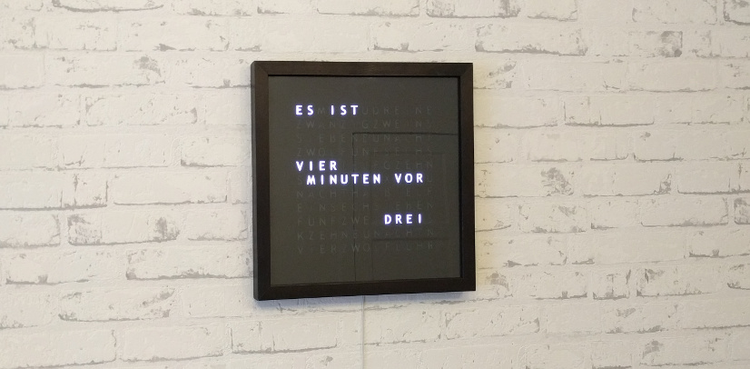
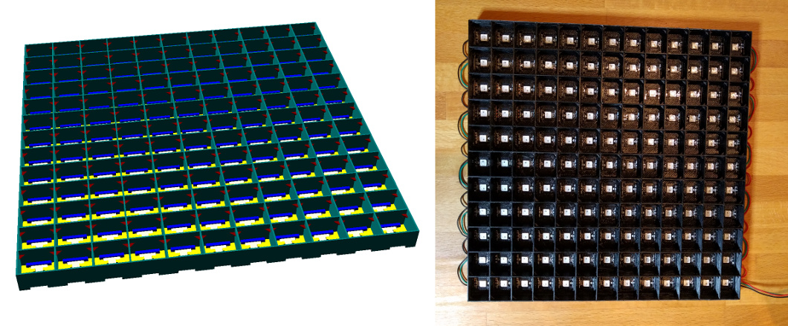
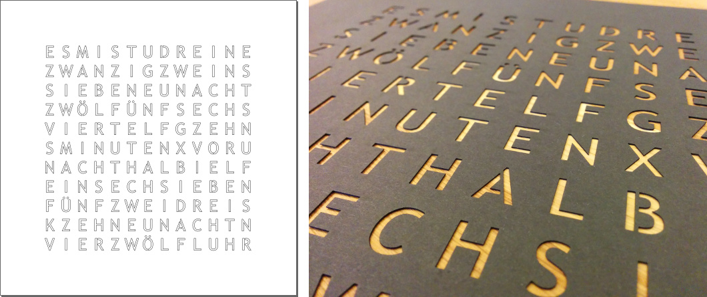

# Flo's word clock

This is my DIY version of a word clock, which shows the time as it is spoken.
It consists of 143 LEDs (13 x 11) behind a predefined letter layout.

Unlike many other word clock implementations it can express every minute of the day (not just every fifth).

## Parts list

I used the following components:

 - 143 WS2812B LEDs on a strip with 60 LEDs/meter, so you need 3 meters
 - 5 V Power supply with about 8 A output current (I used a [MeanWell LPV-60-5](https://www.meanwell-web.com/en-gb/ac-dc-single-output-led-driver-constant-voltage-cv-lpv--60--5))
   - each of the 143 LEDs can draw about 50-60 mA (but normally the total consumption is below 500mA)
 - DOIT ESP32 DEVKIT V1 microcontroller board
 - 3.3V to 5V logic level converter
 - Picture frame that can hold 30 x 30 x 1.5 cm
 - 3D printed socket for the LEDs, see below
 - frosted acrylic glass (3 mm) to diffuse the light (alternatively semi-transparent paper will also work)
 - The letter matrix made of black cardboard cut out by laser, see below

## 3D printed socket for the LED strips

You will find the [OpenSCAD](https://www.openscad.org/) model (and also a generated .stl file) to hold the LED strips in place in the 3d-print folder:
[wordclock_led_boxes.scad](./3d-print/wordclock_led_boxes.scad)

## Laser cut layout

For the letter layout there is a [.svg file](./letter-layout/layout-13x11-path.svg).
This has to be cut out of a 30 cm x 30 cm piece of cardboard.

## Light scattering

For an even illumination of each letter I used a 3 mm frosted acrylic glass,
which I cut into small pieces 15.7 mm x 18.5 mm each, to fit into the 3D printed LED socket.

## Software compilation

### Prepare IDE for ESP32

 1. Install and run Arduino IDE _(version >= 1.8.8)_
 2. Add "Additional Boards Manager URL" (in menu: "File -> Preferences"):  
     `https://dl.espressif.com/dl/package_esp32_index.json`
 3. Install via "Boards Manager" (in menu: "Tools -> Boards"):  
     - `esp32`              by `Espressif Systems` _(version >= 1.0.0)_  
     - `Arduino AVR Boards` by `Arduino`           _(version >= 1.6.23)_
 4. Select Board: `DOIT ESP32 DEVKIT V1`

### Used libraries

The following software libraries are used and can be installed via the Arduino IDE "Library Manager":

 - `NeoPixelBus` by `Makuna`         _(version >= 2.4.1)_
 - `MQTT`        by `Joel Gaehwiler` _(version >= 2.4.1)_

